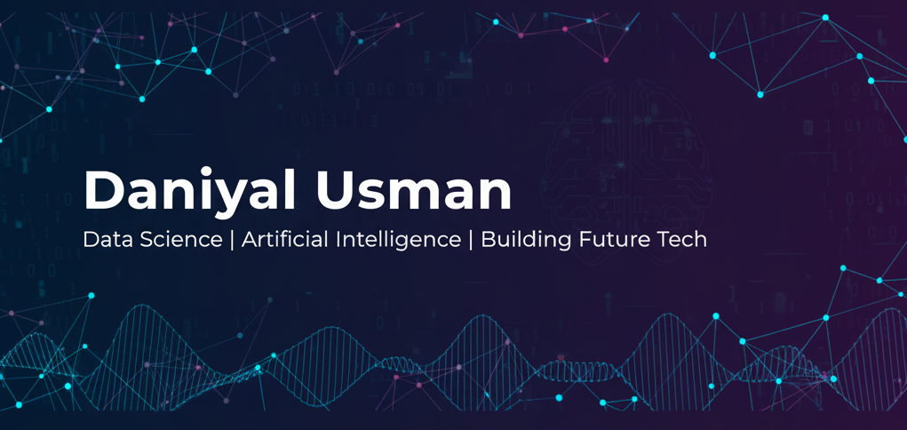

# 👋 Hello, I'm Daniyal Usman!

**Full Name:** Daniyal Usman 
**University:** Punjab University College of Information Technology (PUCIT)  
**Department:** BS Data Science  
I'm a passionate Data Science student with expertise in C++ programming, web development, and digital marketing. I love building impactful digital products and exploring the intersection of technology and business. My goal is to become a skilled Data Scientist and contribute to innovative tech solutions.
> 🎯 **My Motto:** "Turning data into decisions and ideas into impact"

---

## 🛠️ Skills

### Programming & Technical
- `C++` • `Object-Oriented Programming (OOP)` • `Python` • `HTML/CSS`
- `Data Analysis` • `Problem Solving` • `Git & GitHub`

### Professional
- `Digital Marketing` • `Social Media Management` • `Data Entry`
- `Time Management` • `Critical Thinking` • `E-commerce Platforms`

### Tools & Platforms
- `Facebook/Instagram Ads` • `Microsoft Office` • `VS Code`
## 📊 GitHub Stats

## 📂 My GitHub Repositories

### 🔥 Featured Projects

| Project | Description | Technologies |
|---------|-------------|-------------|
| [Data Structures and Algorithms (DSA) – C++](https://github.com/daniyal-devx/Data-Structures-and-Algorithms) | C++ implementations of data structures and algorithms from PUCIT coursework | C++, DSA, OOP |
| [FreeCodeCamp Workshops](https://github.com/daniyal-devx/freecodecamp-workshops) | Full-stack web development projects from FreeCodeCamp curriculum | HTML, CSS, JavaScript |
| [Furniture Store Website](https://github.com/daniyal-devx/Project-Website-) | Responsive e-commerce website for a furniture store | HTML, CSS, JavaScript |

### 📝 Project Descriptions
> **Data Structures and Algorithms (DSA) – C++** - Comprehensive collection of C++ implementations covering various data structures and algorithms, continuously updated throughout my academic journey at PUCIT.

> **FreeCodeCamp Workshops** - Collection of responsive web projects built during my Full Stack Development learning path, showcasing front-end development skills.

> **Furniture Store Website** - A fully responsive e-commerce website for a furniture store featuring modern UI/UX design and interactive elements.

--- 

## 🎯 Goals Checklist

- [ ] Master Python for Data Science
- [ ] Complete 5+ real-world data projects
- [ ] Learn Machine Learning fundamentals
- [ ] Contribute to open-source projects
- [ ] Build a comprehensive data portfolio
- [ ] Secure a Data Science internship
## 📫 Contact Me

Let's connect and collaborate! 

- 📧 **Email:** [daniyalusman.dev@gmail.com](mailto:daniyalusman.dev@gmail.com)
- 💼 **LinkedIn:** [LinkedIn Profile](https://www.linkedin.com/in/daniyalusman-dev)
- 📱 **Phone:** +92-319-4582732
- 🏠 **Location:** Lahore, Pakistan
## 🗣️ Languages

- **English** - Fluent
- **Urdu** - Native

---

## 📚 Education

| Degree | Institution | Duration | Score |
|--------|-------------|----------|-------|
| BS Data Science | PUCIT | 2024 – Present | Ongoing |
| Intermediate (ICS) | Punjab College, Muslim Town | 2022 – 2024 | 84% |
| Matriculation (Science) | Dar-e-Arqam School | 2020 – 2022 | 95% |
## 💼 Experience

**Freelance Digital Marketer** | *Remote* | *2024*

- Managed social media campaigns for local businesses
- Ran Facebook/Instagram ads and created engaging content
- Improved online presence by **35%** in 3 months
- Gained hands-on experience in marketing tools and business growth

---

## 🏆 Certifications

- **AI for Everyone** - Coursera (2025) - Instructor: Andrew Ng

---

### ⭐ Feel free to explore my repositories and don't hesitate to reach out!

